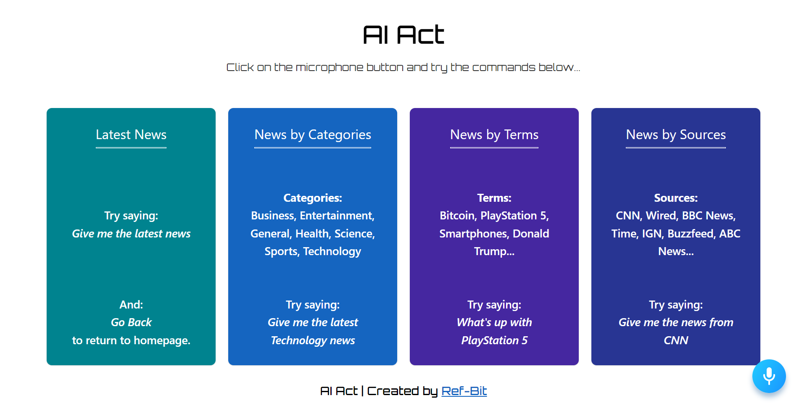

## AI Act 🤖

A web app to read news from different resources through Alan AI.

---

#### Built With

- [React.js](https://reactjs.org) - A JavaScript library for building user interfaces.
- [Alan AI](https://alan.app) - Add a Voice Assistant to your application.
- [News API](https://newsapi.org) - Search worldwide news with code.
- [Material-UI](https://material-ui.com) - Build your own design system, or start with Material Design.

#### Getting Started

- Run `npm install` to install npm packages.
- Register at News API and get your API key.
- Register at Alan AI and paste your API key in a new `.env` file.
- Create a new Alan asstiant.
- Implement the code base in Alan AI environment from [Base Code](https://gist.github.com/Ref-Bit/4242956a21388aaf7e36a44a1f8c625a).
- Paste your `NEWS_API_KEY` in the code base.
- Run `npm start` to run the app successfully in development environment.
